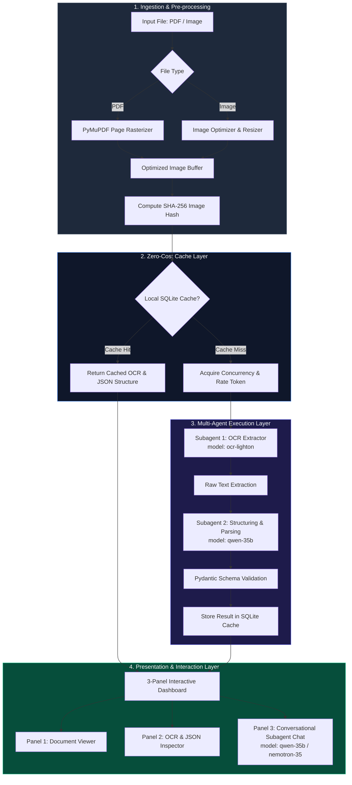
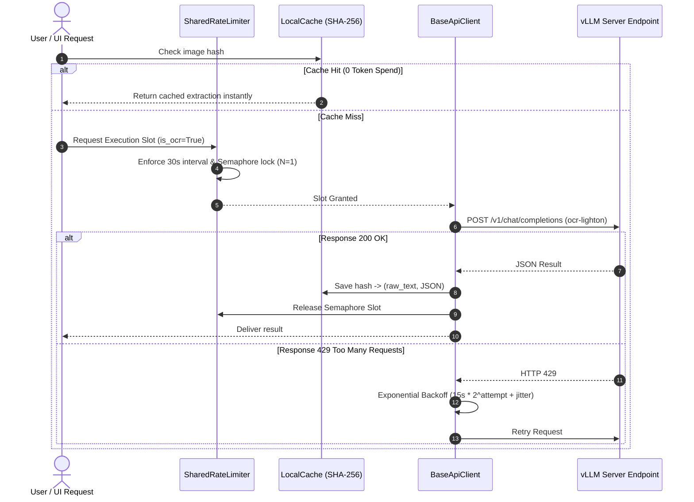

# OCH-Subagent

> **Distributed Multi-Agent Optical Character Recognition and Document Intelligence Pipeline**

[](https://www.python.org/)
[](https://fastapi.tiangolo.com)
[](https://pymupdf.readthedocs.io/)
[](LICENSE)
[]()

---

## Table of Contents

- [Overview](#overview)
- [System Architecture](#system-architecture)
- [Subagent Hierarchy & Model Allocation](#subagent-hierarchy--model-allocation)
- [Rate Limiting & Shared Quota Management](#rate-limiting--shared-quota-management)
- [Key Features](#key-features)
- [Project Directory Structure](#project-directory-structure)
- [Installation & Quick Start](#installation--quick-start)
- [Configuration Reference](#configuration-reference)
- [API Endpoints](#api-endpoints)
- [Verification & Testing](#verification--testing)
- [License](#license)

---

## Overview

**OCH-Subagent** is an enterprise-grade document intelligence system designed to process multi-page PDFs, government documents, and financial receipts (PNG/JPG) using a coordinated multi-agent architecture. 

The system couples visual extraction via high-throughput OCR models (`ocr-lighton`) with structural JSON parsers (`qwen-35b`) and conversational document assistants (`nemotron-35`, `qwen-35b`). It features a strict **Shared-Quota Safety Engine** engineered specifically to prevent HTTP 429 collisions in multi-user shared API environments.

---

## System Architecture

The following diagram illustrates the lifecycle of a document from ingestion and rendering through multi-agent processing and web visualization:



---

## Subagent Hierarchy & Model Allocation

The pipeline delegates specialized tasks across discrete models to optimize throughput, latency, and token consumption:

| Subagent Component | Assigned Model | Functional Responsibility | Concurrency & Rate Policy |
| :--- | :--- | :--- | :--- |
| **OCR Extraction Subagent** | `ocr-lighton` | Extracts raw character data, table structures, and visual hierarchies using Base64 payload. | **Strict 1-2 req/min** (30s interval lock), sub-8,000 token cap. |
| **Schema Structuring Subagent** | `qwen-35b` | Transforms unstructured OCR text into typed Pydantic models (Receipts, GovDocs, Invoices). | 40 req/min general limit, 1,500 token completion window. |
| **Conversational Chat Subagent** | `qwen-35b` / `nemotron-35` | Answers multi-turn questions grounded directly in document OCR context. | Streaming support, automatic reasoning trace filtration. |
| **Visual Fallback Subagent** | `qwen-35b-vision` | Visual layout verification when character confidence falls below baseline. | On-demand invocation. |

---

## Rate Limiting & Shared Quota Management

In resource-constrained environments where an API quota is shared across multiple engineers or services (e.g., $0.70/day cap, 6 RPM limit for OCR, max 5 global concurrent slots), OCH-Subagent enforces an automated seven-layer defensive protocol:



### Safety Layer Breakdown

1. **SHA-256 Deterministic Caching**: Repeated analysis on the same page or image returns directly from SQLite cache, consuming 0 tokens.
2. **Leaky-Bucket Interval Locking**: A minimum 30-second sleep is enforced between OCR requests to prevent team token depletion.
3. **Local Concurrency Isolation**: Hard-capped to `MAX_CONCURRENT_REQUESTS = 1` to leave server slots open for team members.
4. **Jittered Exponential Backoff**: Automatic retry handler responding to HTTP 429 with randomized jitter ($15s \cdot 2^{n} + \Delta t$) preventing synchronized retry storms.
5. **Automated Token Optimization**: Image resizing (max dimension 1400px, JPEG quality 85) to ensure request payloads stay well below the 8,000 token/minute ceiling.
6. **Reasoning Trace Sanitizer**: Filters out internal model chain-of-thought blocks (`<think>`, `Here's a thinking process:...`) before delivering clean human responses.
7. **Daily Emergency Stop**: Automatic circuit breaker halting local execution when the user reaches daily safety limits.

---

## Key Features

- **High-Performance PDF Engine**: Integrated with `PyMuPDF` (`fitz`) for rapid rendering and robust error recovery on corrupted documents.
- **Support for Both PDF and Receipts**:
  - **Government & Enterprise Documents**: Title, classification, issuing agency, dates, and reference numbers.
  - **Supermarket & Dining Receipts**: Merchant header, transaction timestamps, cashier IDs, itemized product tables (Qty, Unit Price, Line Total), tax (PPN), discounts, and grand totals.
- **Hugging Face Hub Integration**: One-click downloader for the [`BEE-spoke-data/govdocs1-pdf-source`](https://huggingface.co/datasets/BEE-spoke-data/govdocs1-pdf-source) dataset.
- **Modern 3-Panel Web Interface**: Fully responsive, dark-mode glassmorphic interface with real-time countdown timer for OCR cooldown, active concurrency monitor, and daily call statistics.

---

## Project Directory Structure

```
d:/OCH-Subagent/
├── .env.example              # Environment variable template
├── .gitignore                # Exclusion list for keys, databases, and logs
├── README.md                 # Technical project documentation
├── requirements.txt          # Python dependencies
├── main.py                   # Application entrypoint
├── plan.md                   # System design blueprint
├── data/
│   └── govdocs/              # Document storage (PDF, PNG, JPG)
├── src/
│   ├── config.py             # Pydantic Settings & environment schema
│   ├── dataset/
│   │   ├── hf_downloader.py  # Hugging Face dataset downloader
│   │   └── init_samples.py   # Sample document initializer
│   ├── limiter/
│   │   ├── rate_limiter.py   # Sliding-window & concurrency lock
│   │   └── quota_guard.py    # Daily budget tracking & emergency stop
│   ├── client/
│   │   ├── base_client.py    # Async HTTP client with backoff & mock modes
│   │   └── ocr_client.py     # Base64 array payload formatter for ocr-lighton
│   ├── cache/
│   │   └── local_cache.py    # SQLite SHA-256 result cache
│   ├── agents/
│   │   ├── base_agent.py     # Subagent abstract base class
│   │   ├── ocr_agent.py      # Raw OCR extractor subagent
│   │   ├── parser_agent.py   # Schema structuring subagent
│   │   └── chat_agent.py     # Document conversational Q&A subagent
│   ├── pipeline/
│   │   ├── orchestrator.py   # Workflow coordinator
│   │   └── schemas.py        # Pydantic models for extraction outputs
│   ├── server/
│   │   └── app.py            # FastAPI application & static routing
│   └── utils/
│       ├── image_utils.py    # Image optimizer & Base64 encoder
│       └── pdf_utils.py      # PyMuPDF page-to-image rasterizer
├── web/
│   ├── index.html            # 3-Panel workspace interface
│   ├── style.css             # Glassmorphism design system
│   └── app.js                # Frontend state machine & polling logic
└── tests/
    ├── test_cache.py         # SHA-256 cache verification test
    ├── test_limiter.py       # Rate limiter and concurrency test
    ├── test_mock_pipeline.py # End-to-end mock execution test
    └── test_live_api.py      # Live API diagnostic and connectivity test
```

---

## Installation & Quick Start

### Prerequisites

- Python 3.10 or higher
- Access to an OpenAI-compatible vLLM/API endpoint

### 1. Clone the Repository

```bash
git clone https://github.com/loxleyftsck/OCH-Subagent.git
cd OCH-Subagent
```

### 2. Set Up Virtual Environment

```bash
# Linux / macOS
python3 -m venv .venv
source .venv/bin/activate

# Windows PowerShell
python -m venv .venv
.venv\Scripts\Activate.ps1
```

### 3. Install Dependencies

```bash
pip install --upgrade pip
pip install -r requirements.txt
```

### 4. Configure Environment Variables

Create a `.env` file based on `.env.example`:

```bash
cp .env.example .env
```

Edit `.env` with your API configuration:

```ini
API_BASE_URL=http://10.7.1.21/v1
API_KEY=sk-your_api_key_here

OCR_MODEL=ocr-lighton
TEXT_MODEL=qwen-35b
CHAT_MODEL=qwen-35b
ROUTER_MODEL=nemotron-35

TEAM_SHARED_MODE=true
MAX_CONCURRENT_REQUESTS=1
OCR_INTERVAL_SECONDS=30.0
MAX_DAILY_LOCAL_OCR_CALLS=25
ENABLE_LOCAL_CACHE=true
MOCK_MODE=false
```

### 5. Launch the Application

```bash
python main.py
```

Access the interactive dashboard in your browser:
```
http://localhost:8000
```

---

## API Endpoints

| Method | Endpoint | Description | Parameters / Payload |
| :--- | :--- | :--- | :--- |
| `GET` | `/api/safety/status` | Retrieves real-time rate limit cooldown, concurrency, and token usage. | None |
| `GET` | `/api/documents` | Lists all documents and receipts in the local storage directory. | None |
| `POST` | `/api/documents/download-hf` | Downloads sample records from Hugging Face `govdocs1-pdf-source`. | `row_index` (default: 4) |
| `POST` | `/api/documents/upload` | Uploads a custom PDF or image (`multipart/form-data`). | `file` |
| `GET` | `/api/documents/{filename}/meta` | Returns total page count, dimensions, and file metadata. | `filename` (path) |
| `GET` | `/api/documents/{filename}/page/{page_number}/image` | Renders a specific PDF page or image as a JPEG stream. | `filename`, `page_number`, `scale` |
| `POST` | `/api/documents/{filename}/ocr` | Executes OCR extraction and JSON structuring subagents. | `filename`, `page_number`, `auto_structure` |
| `POST` | `/api/chat` | Interacts with the document context via conversational subagent. | `ChatRequest` (JSON) |

---

## Verification & Testing

### Automated Unit Tests

Execute the test suite to verify caching, rate limiting, and mock pipeline execution:

```bash
python tests/test_cache.py
python tests/test_limiter.py
python tests/test_mock_pipeline.py
```

### Live API Connectivity Diagnostic

Test direct connection to the model server (`ocr-lighton` & `qwen-35b`):

```bash
python tests/test_live_api.py
```

---

## License

This project is licensed under the MIT License. See [LICENSE](LICENSE) for details.
