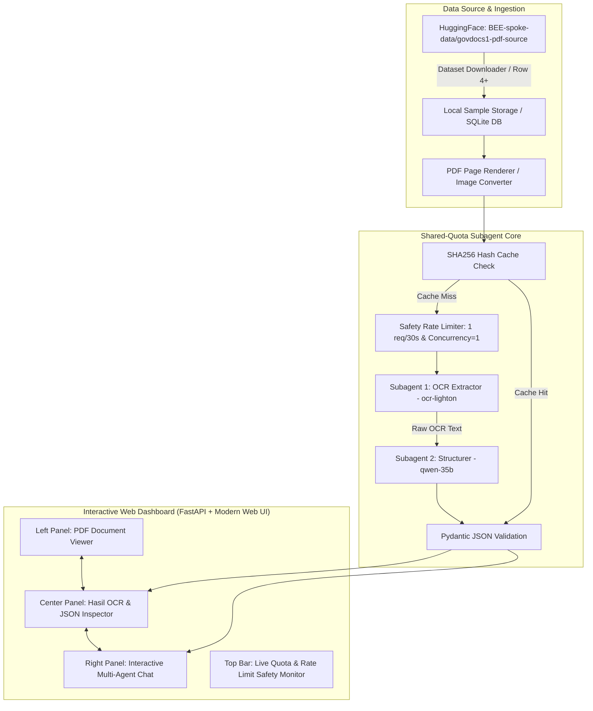

# Plan: OCH-Subagent (OCR & Document Intelligence Multi-Agent System)

Sistem pemrosesan dokumen/PDF berbasis multi-agent dengan **Interactive Web Dashboard (PDF Viewer, Hasil OCR, Chat Subagent)** dan **Shared-Quota Safety (Anti-429 Rate Limiter)** untuk lingkungan tim (7 orang).

---

## 1. Arsitektur Komprehensif Sistem



---

## 2. Fitur Utama Sistem

### A. PDF Viewer Terintegrasi (Left Panel)
- Menampilkan dokumen PDF per halaman secara visual (menggunakan canvas / embedded PDF viewer / image slice).
- Pilihan navigasi halaman (*previous*, *next*, *zoom in/out*).
- Indikator halaman yang sedang dianalisis oleh OCR.

### B. Hasil OCR & JSON Inspector (Center Panel)
- **Raw OCR Tab**: Tampilan teks mentah hasil ekstraksi dari `ocr-lighton` dengan indikator line break dan hierarki.
- **Structured JSON Tab**: Tampilan JSON terstruktur (diolah oleh `qwen-35b`) dengan visualisasi key-value dan syntax highlighting.
- **Confidence & Cache Badge**: Menampilkan status (*Cache Hit* ⚡ atau *Live API Call* 🌐) serta estimasi token yang terpakai.

### C. Interactive Subagent Chat (Right Panel)
- Chat interaktif dengan dokumen menggunakan `qwen-35b` / `nemotron-35`.
- Dapat menjawab pertanyaan pengguna terkait isi PDF, menghitung total nilai, memvalidasi nomor dokumen, mencari klausa penting, atau merangkum isi halaman.
- Subagent memiliki konteks langsung dari hasil OCR dan metadata dokumen.

### D. Dataset Downloader (`BEE-spoke-data/govdocs1-pdf-source`)
- Skrip downloader otomatis untuk mengambil sample PDF dari Hugging Face Hub (termasuk row indeks 4 dan seterusnya).
- Menyimpan file PDF lokal di `data/govdocs/` dan metadata di database SQLite lokal.

### E. Live Quota & Shared-Safety Monitor (Top Bar)
- Indikator status rate limiter (hitungan mundur jeda 30 detik untuk OCR).
- Indikator concurrency slot (1 aktif dari max 5 slot bersama).
- Pengatur mode (`MOCK_MODE=True/False`, `TEAM_SHARED_MODE=True/False`).

---

## 3. Matriks Model & Tugas Subagent

| Model Identifier | Tugas Subagent | Batasan Rate Limit (Safety Mode) |
| :--- | :--- | :--- |
| `ocr-lighton` | **OCR Extractor**: Ekstraksi teks base64 dari potongan halaman PDF | Strict: Jeda 30 detik (1-2 RPM), no `enable_thinking` |
| `qwen-35b` | **Parser & Structurer**: Menata teks mentah menjadi JSON terstruktur | Max 5 RPM, concurrency 1 |
| `qwen-35b` / `nemotron-35` | **Document Chat Assistant**: Menjawab tanya-jawab user berbasis teks OCR dokumen | Streaming response, conversational buffer |
| `qwen-35b-vision` | **Visual Fallback**: Memeriksa diagram/tabel jika teks OCR ambigu | On-demand fallback |

---

## 4. Struktur Direktori Lengkap

```
d:/OCH-Subagent/
├── .env                      # API Key, Endpoint, Safety Thresholds
├── .env.example              # Template Environment Config
├── plan.md                   # Blueprint Sistem
├── requirements.txt          # fastapi, uvicorn, pydantic, pillow, pdf2image, httpx, datasets
├── data/
│   ├── govdocs/              # Direktori penyimpanan PDF dari Hugging Face
│   ├── cache/                # Cache hasil OCR (SHA256 based)
│   └── database.sqlite       # Metadata dokumen & riwayat chat
├── src/
│   ├── __init__.py
│   ├── config.py             # Konfigurasi sistem, model, kuota safety
│   ├── dataset/
│   │   ├── __init__.py
│   │   └── hf_downloader.py  # Downloader dataset govdocs1-pdf-source dari HF
│   ├── limiter/
│   │   ├── __init__.py
│   │   ├── rate_limiter.py   # Sliding-window limiter jeda 30s & concurrency lock
│   │   └── quota_guard.py    # Daily budget tracking & emergency stop
│   ├── client/
│   │   ├── __init__.py
│   │   ├── base_client.py    # Async HTTP client + 429 Jitter Backoff + Mocking
│   │   └── ocr_client.py     # Base64 encoder, dynamic MIME builder untuk ocr-lighton
│   ├── cache/
│   │   ├── __init__.py
│   │   └── local_cache.py    # File/SQLite hash cache (0 API call untuk re-run)
│   ├── agents/
│   │   ├── __init__.py
│   │   ├── base_agent.py     # Base subagent class
│   │   ├── ocr_agent.py      # Subagent ekstraksi OCR
│   │   ├── parser_agent.py   # Subagent parsing JSON terstruktur
│   │   └── chat_agent.py     # Subagent interactive Q&A berbasis dokumen
│   ├── pipeline/
│   │   ├── __init__.py
│   │   ├── orchestrator.py   # Multi-agent coordinator
│   │   └── schemas.py        # Pydantic schemas (Dokumen Pemerintah, Faktur, Nota)
│   ├── server/
│   │   ├── __init__.py
│   │   └── app.py            # FastAPI REST & WebSocket / SSE server
│   └── utils/
│       ├── __init__.py
│       ├── pdf_utils.py      # Konversi halaman PDF ke Image
│       └── image_utils.py    # Resize, compress, dan Base64 encoding
├── web/
│   ├── index.html            # 3-Panel Modern Dashboard (PDF Viewer, OCR, Chat)
│   ├── style.css             # Glassmorphism & sleek dark mode UI
│   └── app.js                # Frontend controller & streaming state
├── tests/
│   ├── test_safety_limiter.py
│   ├── test_cache.py
│   └── test_ocr_flow.py
└── main.py                   # Entrypoint untuk menjalankan server dashboard & CLI
```

---

## 5. Rencana Langkah Implementasi

1. **Inisialisasi Project & Konfigurasi** (`requirements.txt`, `.env.example`, `config.py`)
2. **Dataset Downloader & PDF Handler** (`hf_downloader.py`, `pdf_utils.py`) untuk mengambil sample row 4 dari Hugging Face
3. **Core Shared-Safety & Rate Limiter** (`rate_limiter.py`, `local_cache.py`, `base_client.py`)
4. **Subagents Core** (`ocr_agent.py`, `parser_agent.py`, `chat_agent.py`)
5. **Backend Server API** (`app.py` dengan endpoint upload/fetch PDF, trigger OCR, dan streaming Chat)
6. **Frontend 3-Panel Dashboard** (`index.html`, `style.css`, `app.js` dengan PDF Viewer, Hasil OCR, dan Chat)
7. **Verifikasi & Uji Coba End-to-End**
