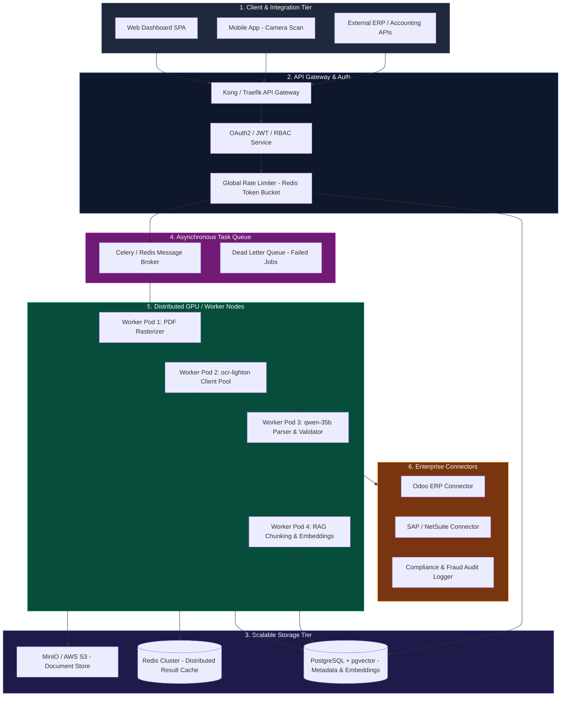
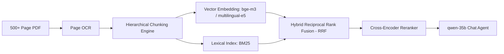

# OCH-Subagent Enterprise Scale-Up Blueprint

> **Architectural Roadmap & Engineering Strategy for Scaling from Local Subagent to High-Throughput Enterprise SaaS**

---

## 1. Executive Summary & Scale-Up Vision

The current implementation of **OCH-Subagent** successfully validates:
- Multi-agent document processing (`ocr-lighton` $\rightarrow$ `qwen-35b` $\rightarrow$ `nemotron-35`).
- Shared-quota rate limiting and local SQLite zero-cost caching.
- Integrated 3-panel UI with interactive document Q&A.

To transition this system into an **Enterprise-Grade Distributed SaaS Platform** capable of processing **100,000+ pages daily** with **99.9% uptime** and **multi-tenant isolation**, this blueprint outlines the technical roadmap across 5 phases.

---

## 2. Target Enterprise Architecture



---

## 3. Scale-Up Implementation Phases

### Phase 1: Asynchronous Task Processing & Queue Layer (Months 1–2)

**Goal**: Decouple document upload from OCR extraction to handle massive concurrent batch uploads without blocking HTTP server threads.

- **Message Broker**: Deploy **Redis / RabbitMQ** with **Celery** or **ARQ (Async Python Queue)**.
- **WebSocket Streaming**: Stream page-by-page progress in real-time to the dashboard via WebSockets (`/ws/documents/{job_id}/progress`).
- **Dead-Letter Handling**: Automatic retry mechanism with exponential backoff for corrupted PDFs or temporary API outages.
- **Batch Processing**: Support `.zip` or folder bulk uploads containing up to 500 documents per batch.

```python
# Target Task Architecture
@celery_app.task(bind=True, max_retries=3, default_retry_delay=15)
def process_document_job(self, document_id: str, tenant_id: str):
    # Asynchronous background execution
    ...
```

---

### Phase 2: Enterprise Database & Multi-Tenant Storage (Months 2–3)

**Goal**: Transition from local disk storage and SQLite to highly available distributed database systems.

- **Object Storage**: Integrate **MinIO / AWS S3** for document retention, generating secure presigned URLs for client viewing.
- **Relational Metadata**: Migrate from SQLite to **PostgreSQL 16+** with relational tables:
  - `tenants`, `users`, `api_keys`, `documents`, `pages`, `ocr_results`, `receipt_items`, `audit_logs`.
- **Distributed Cache**: Replace local SQLite cache with **Redis Cluster** supporting TTL policies, cache invalidation, and cross-node SHA-256 deduplication.

---

### Phase 3: Advanced Hybrid RAG for Long-Form Documents (Months 3–4)

**Goal**: Support 500+ page government documents, legal contracts, and annual financial reports with sub-second semantic retrieval.



- **Hierarchical Document Chunking**: Chunk text based on structural headings, articles, and table boundaries rather than arbitrary token splits.
- **Hybrid Retrieval (RRF)**: Combine keyword search (**BM25**) with dense semantic search (**pgvector** / **Qdrant**) for accurate retrieval of exact invoice numbers and abstract clauses.
- **Cross-Encoder Reranking**: Re-score top 20 candidate chunks to deliver high-precision context to `qwen-35b`.

---

### Phase 4: Business Connectors & Automated Fraud Detection (Months 4–5)

**Goal**: Automate real-world business workflows with direct ERP syncing and financial anomaly detection.

1. **ERP Connectors**:
   - **Odoo / SAP / Xero Webhooks**: Automatically push verified receipts and invoices into General Ledger (GL) accounts.
   - **Export Formats**: One-click download as structured Excel (`.xlsx`), CSV, JSON-LD, and audit-ready PDF summaries.

2. **Fraud & Anomaly Detection Engine**:
   - **Duplicate Receipt Detection**: Flags identical image hashes or matching (`merchant`, `date`, `total_amount`) combinations submitted by different employees.
   - **Mathematical Verification**: Automatically checks if `subtotal - discount + tax == grand_total`. If discrepancies exceed $\pm 0.01$, flags for manual audit review.
   - **Tamper Detection**: Metadata inspection checking for image alteration signatures (Photoshop / Exif discrepancies).

---

### Phase 5: Production Deployment & Observability (Months 5–6)

**Goal**: High availability, automated autoscaling, and real-time observability.

- **Containerization & Orchestration**: Kubernetes (K8s) deployment with Helm charts.
- **Horizontal Pod Autoscaler (HPA)**: Auto-scale worker pods based on queue depth and GPU memory utilization.
- **Telemetry & Monitoring**:
  - **Prometheus & Grafana**: Live dashboard tracking RPM, 429 rate limit triggers, CER/WER accuracy, and token spend per tenant.
  - **OpenTelemetry & Jaeger**: Distributed tracing from frontend click to LLM completion.

---

## 4. Resource Allocation & Timeline Summary

| Milestone | Key Deliverable | Target Timeline | Expected Impact |
| :--- | :--- | :--- | :--- |
| **Milestone 1** | Redis Queue + Celery Workers + WebSocket Progress | Month 1 | Zero HTTP timeouts on large PDF uploads. |
| **Milestone 2** | PostgreSQL + S3 Object Storage + Multi-Tenancy | Month 2 | Secure multi-user enterprise isolation. |
| **Milestone 3** | Hybrid RAG (pgvector + BM25) for 500+ page docs | Month 3 | Sub-second accurate answers on long contracts. |
| **Milestone 4** | ERP Sync (Odoo/SAP) + Anti-Fraud Math Validator | Month 4 | Direct integration into enterprise accounting pipelines. |
| **Milestone 5** | K8s Deployment + Prometheus/Grafana Dashboards | Month 5 | 99.9% High Availability with auto-scaling. |

---

## 5. Next Steps for Development Team

1. Initialize `src/queue/` directory and configure Celery worker skeleton.
2. Draft PostgreSQL schema migrations using Alembic.
3. Configure MinIO storage container for local development.
4. Implement WebSocket progress event emitter in FastAPI backend.
